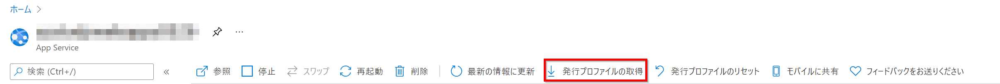
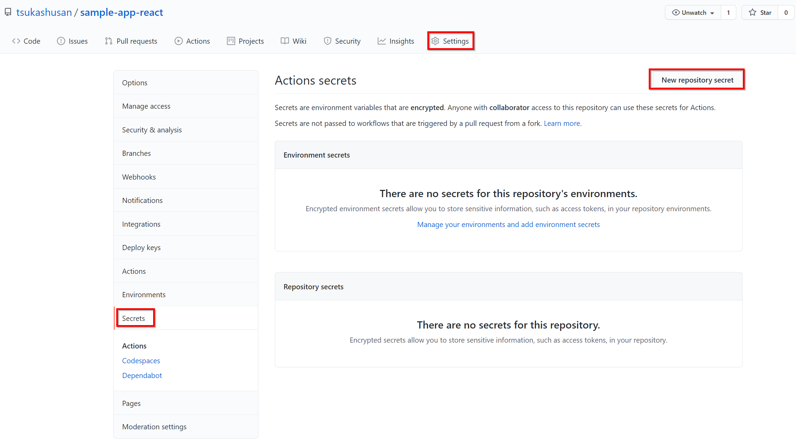
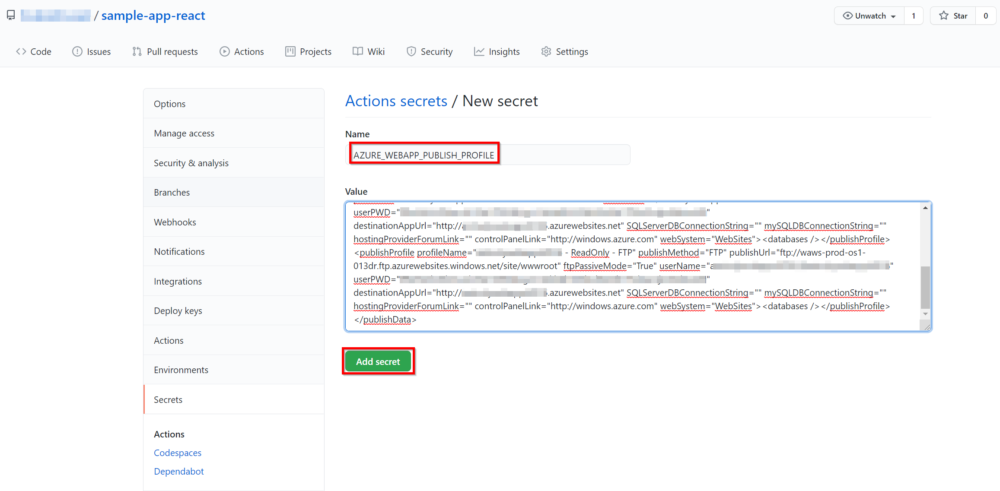
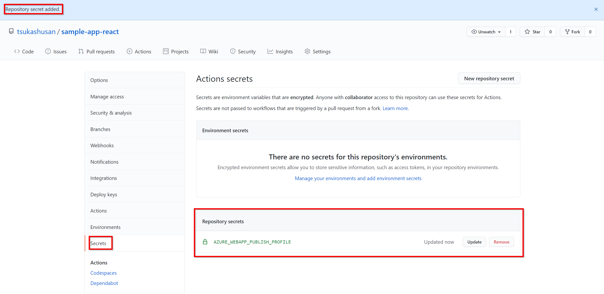

# Getting Started React App with GitHub Actions

This project was bootstrapped with [Create React App](https://github.com/facebook/create-react-app).

You can create and deploy React.js application on Azure Web Apps.

## How to use

### Clone this Repository

Choose clone or fork this repository

#### STEP 1 Clone

```sh
git clone <url of this repo>
cd react-web-app-deploy
rm -rf .git
```
### STEP 2 Create Web App BEFORE you deploy (bicep + PowerShell)

#### 2-1
Edit _azuredeploy.parameters.dev.json_
1. ipaddress: xxx.xxx.xxx.xxx -> Your IP Address of Enviroment
1. appServicePlanName: xxxxx -> Any Name
1. webappsName: xxxxx -> The only name in the global

#### 2-2
Edit _bicep-deploy.ps1_
1. _set-variable -name TENANT_ID "xxxxxxxx-xxxx-xxxx-xxxx-xxxxxxxxxxxx" -option constant_
1. _set-variable -name SUBSCRIPTOIN_GUID "xxxxxxxx-xxxx-xxxx-xxxx-xxxxxxxxxxxx" -option constant_
1. set-variable -name WEBAPP_NAME "xxxxxxxx" -option constant
1. set-variable -name ASP_NAME "xxxxxxxx" -option constant
1. $resourceGroupName = "xxxxx"
1. $location = "xxxxx"
```PowerShell
set-variable -name TENANT_ID "xxxxxxxx-xxxx-xxxx-xxxx-xxxxxxxxxxxx" -option constant
set-variable -name SUBSCRIPTOIN_GUID "xxxxxxxx-xxxx-xxxx-xxxx-xxxxxxxxxxxx" -option constant
set-variable -name WEBAPP_NAME "xxxxxxxx" -option constant
set-variable -name ASP_NAME "xxxxxxxx" -option constant
set-variable -name BICEP_FILE "main.bicep" -option constant
set-variable -name PARAMETER_FILE "azuredeploy.parameters.dev.json" -option constant

$resourceGroupName = "xxxxx"
$location = "xxxxx"
$tier = "Standard"

#Azure Login
Connect-AzAccount -Tenant ${TENANT_ID} -Subscription ${SUBSCRIPTOIN_GUID}

#Create Resource Group 
## az group create --name $RESOURCE_GROUP_NAME  --location $LOCATION
New-AzResourceGroup -Name ${resourceGroupName} -Location ${location} -Verbose

New-AzResourceGroupDeployment `
  -Name devenvironment `
  -ResourceGroupName ${resourceGroupName} `
  -TemplateFile ${BICEP_FILE} `
  -TemplateParameterFile ${PARAMETER_FILE} `
  -Verbose
```

### STEP 2 Create Web App BEFORE you deploy (PowerShell)

```PowerShell
set-variable -name TENANT_ID "xxxxxxxx-xxxx-xxxx-xxxx-xxxxxxxxxxxx" -option constant
set-variable -name SUBSCRIPTOIN_GUID "xxxxxxxx-xxxx-xxxx-xxxx-xxxxxxxxxxxx" -option constant
set-variable -name WEBAPP_NAME "xxxxxxxx" -option constant
set-variable -name ASP_NAME "xxxxxxxx" -option constant

$resourceGroupName = "xxxxx"
$location = "xxxxx"
$tier = "Standard"

#Azure Login
Connect-AzAccount -Tenant ${TENANT_ID} -Subscription ${SUBSCRIPTOIN_GUID}

#Create Resource Group 
## az group create --name $RESOURCE_GROUP_NAME  --location $LOCATION
New-AzResourceGroup -Name ${resourceGroupName} -Location ${location} -Verbose

#az appservice plan create --name $ASP_NAME --resource-group $RESOURCE_GROUP_NAME --sku P1V2
New-AzAppServicePlan  `
  -Name ${ASP_NAME} `
  -Location ${location} `
  -ResourceGroupName ${resourceGroupName} `
  -Tier ${tier}
  -NumberofWorkers 1 `
  -WorkerSize "1"


#az webapp create --name $WEBAPP_NAME --resource-group $RESOURCE_GROUP --plan $ASP_NAME
New-AzWebApp -ResourceGroupName ${resourceGroupName} `
  -Name ${WEBAPP_NAME} `
  -Location ${location} `
  -AppServicePlan ${ASP_NAME}
```


### STEP 2 Create Web App BEFORE you deploy (sh)

```sh
LOCATION=japaneast
WEBAPP_NAME=
ASP_NAME=
RESOURCE_GROUP_NAME=

az group create --name $RESOURCE_GROUP_NAME  --location $LOCATION
az appservice plan create --name $ASP_NAME --resource-group $RESOURCE_GROUP_NAME --sku P1V2
az webapp create --name $WEBAPP_NAME --resource-group $RESOURCE_GROUP --plan $ASP_NAME
```

### STEP 3 Edit YAML
#### _.github/workflows/main.yaml_</br>
AZURE_WEBAPP_NAME: xxxxx -> WEBAPP_NAME


### Set PublishSettings as secret

#### Download PublishSetting file from Azure Portal.


#### Create new secret `AZURE_WEBAPP_PUBLISH_PROFILE` and paste your PublishSetting.

* Name:AZURE_WEBAPP_PUBLISH_PROFILE </br>Value: from ```<WEBAPPS_NAME>.PublishSettings```




